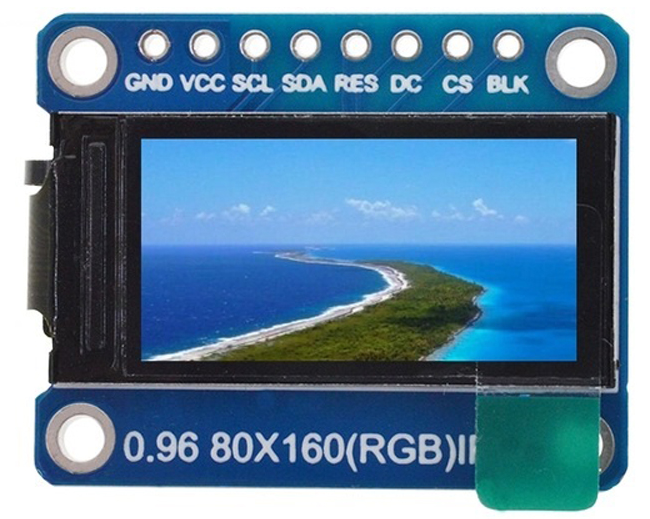
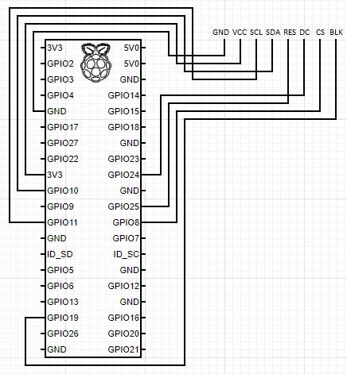

# Python ST7735

[](https://travis-ci.com/pimoroni/st7735-python)
[](https://coveralls.io/github/pimoroni/st7735-python?branch=master)
[](https://pypi.python.org/pypi/st7735)
[](https://pypi.python.org/pypi/st7735)


Python library to control an ST7735 TFT LCD display. Allows simple drawing on the display without installing a kernel module.

Designed specifically to work with a ST7735 based 160x80 pixel TFT SPI display. (Specifically the 0.96" SPI LCD from Pimoroni).

Modified to work with the 8-pin board housing the same display allowing for easy setup. The following two images show the 8-pin board and wiring to a Raspberry Pi:




ST7735 LCD Class setup. *More in example folders.*
````
disp = ST7735.ST7735(
    port=0, # 0 for SPI0 and 1 for SPI1
    cs=0,   # 0 for CE0 and 1 for CE1
    dc=24,
    backlight=19,   # can be any controllable pin
    rst=25,         # can be any controllable pin
    rotation=270,
    invert=False, 
    offset_left=24,
    offset_top=0,
    spi_speed_hz=4000000
)
````

## Installing

### Python 2

Make sure you have the following dependencies:

````
sudo apt update
sudo apt install python-rpi.gpio python-spidev python-pip python-pil python-numpy
````

Install this library by running:

````
sudo pip install st7735
````

### Python 3

Make sure you have the following dependencies:

````
sudo apt update
sudo apt install python3-rpi.gpio python3-spidev python3-pip python3-pil python3-numpy
````

Install this library by running:

````
sudo python3 -m pip install st7735
````

See example of usage in the examples folder.


# Licensing & History

This library is a modification of a modification of code originally written by Tony DiCola for Adafruit Industries, and modified to work with the ST7735 by Clement Skau.

It has been modified by Pimoroni to include support for their 160x80 SPI LCD breakout, and hopefully also generalised enough so that it will support other ST7735-powered displays.

## Modifications include:

* PIL/Pillow has been removed from the underlying display driver to separate concerns- you should create your own PIL image and display it using `display(image)`
* `width`, `height`, `rotation`, `invert`, `offset_left` and `offset_top` parameters can be passed into `__init__` for alternate displays
* `Adafruit_GPIO` has been replaced with `RPi.GPIO` and `spidev` to closely align with our other software (IE: Raspberry Pi only)
* Test fixtures have been added to keep this library stable

Pimoroni invests time and resources forking and modifying this open source code, please support Pimoroni and open-source software by purchasing products from us, too!

Adafruit invests time and resources providing this open source code, please support Adafruit and open-source hardware by purchasing products from Adafruit!

Modified from 'Modified from 'Adafruit Python ILI9341' written by Tony DiCola for Adafruit Industries.' written by Clement Skau.

MIT license, all text above must be included in any redistribution
